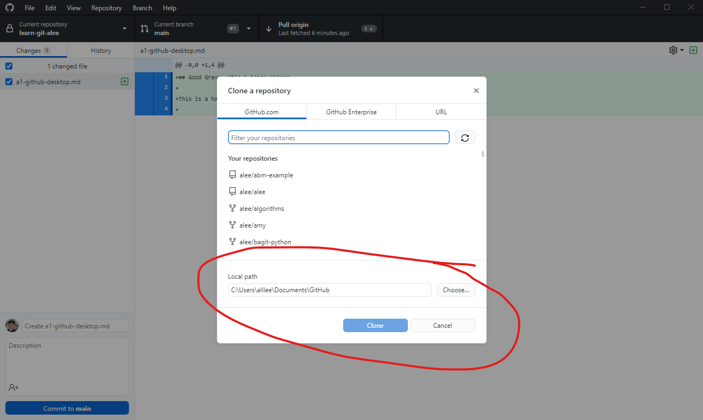
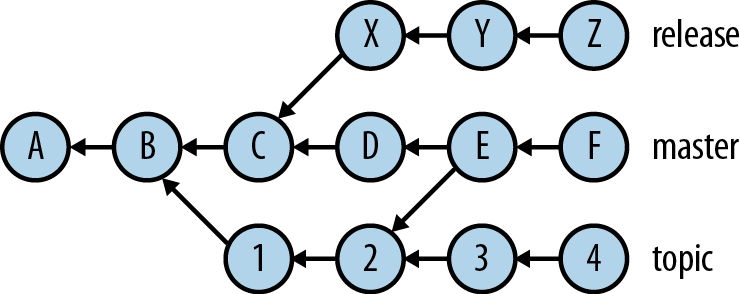
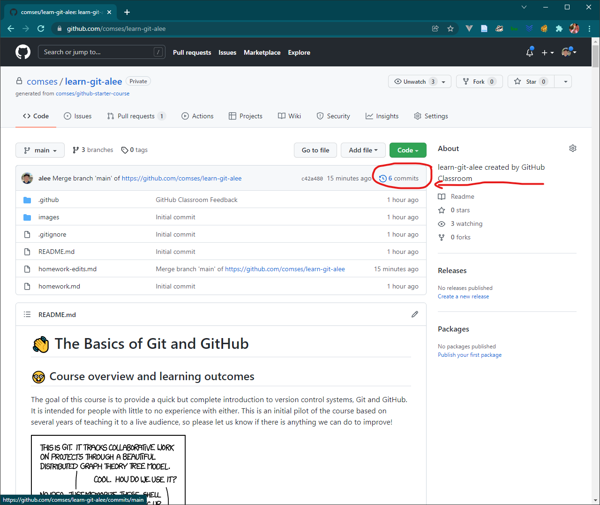
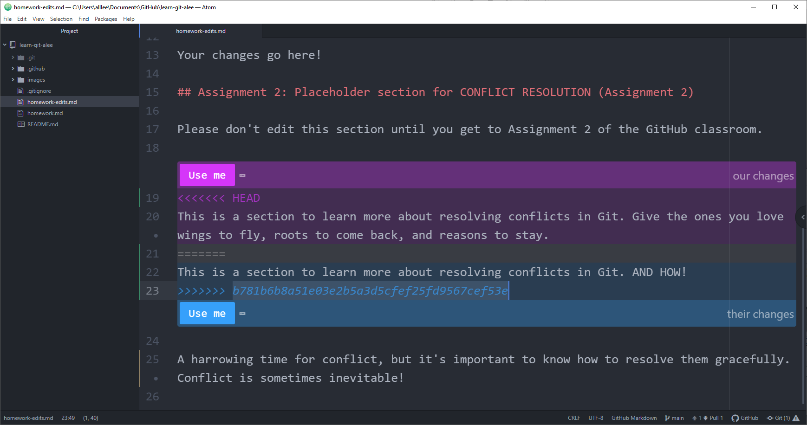
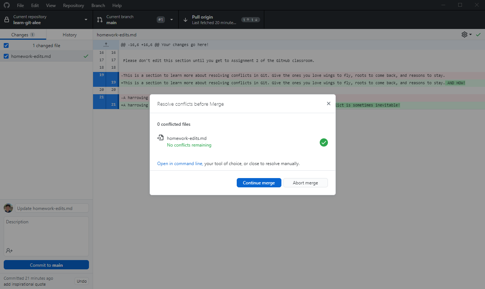
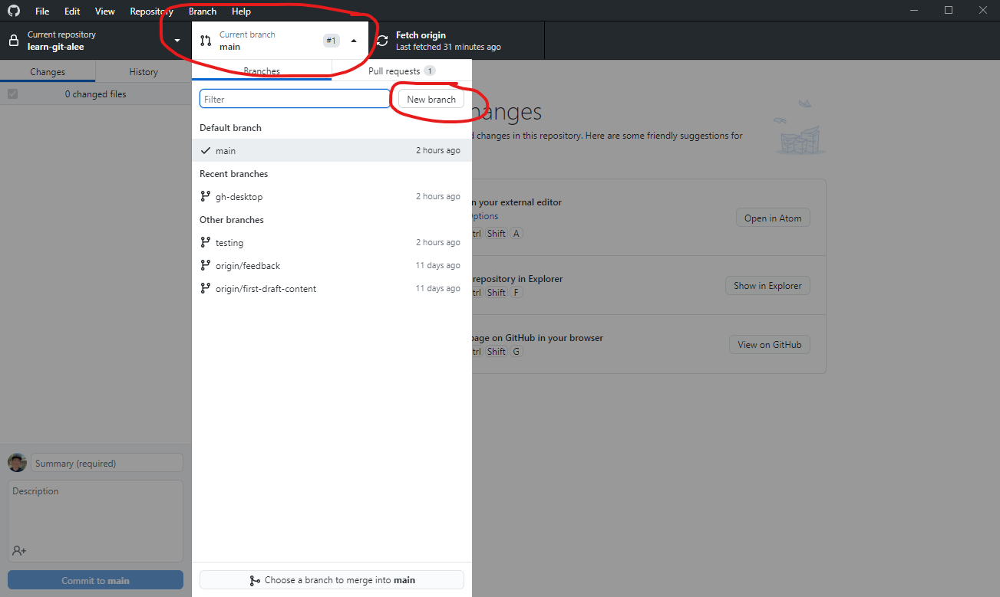
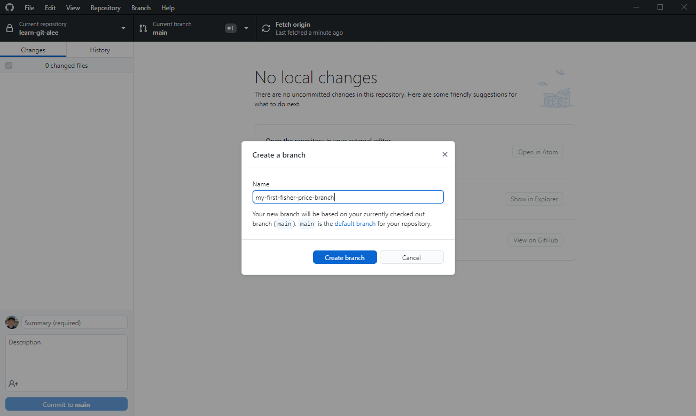
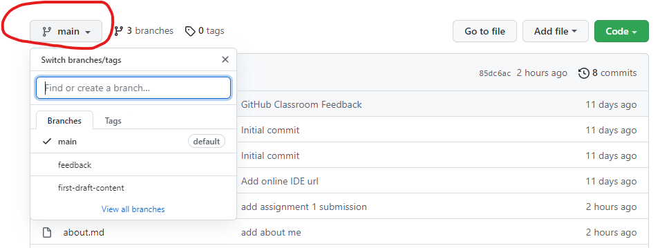
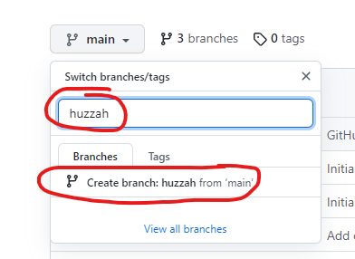

# :wave: The Basics of Git and GitHub

## 🤓 Course overview and learning outcomes 

The goal of this course is to provide a quick but complete introduction to version control systems, Git and GitHub. It is intended for people with little to no experience with either. This is an initial pilot of the course based on several years of teaching it to a live audience, so please let us know if there is anything we can do to improve!


_from [XKCD](https://xkcd.com/1597/)_

### Objectives

- develop a clear conceptual model that answers *What are version control systems and why should I use them? What is Git and how do I use it?*
- become more familiar with the GitHub web interface to edit files, clone and fork repositories, manage branches and pull requests
- practice simple git workflows and become more familiar with git GUI clients e.g. [GitHub Desktop](https://desktop.github.com) or Integrated Development Environments (IDEs) like [VS Code](https://code.visualstudio.com) | [Atom](https://atom.io/) to interact with your local and remote Git repositories

If these are too simple for you, great! We also have [links to more advanced resources](#additional-resources-) that we've found useful over the years. 🚀

## :octocat: Git and GitHub

Git is a **distributed Version Control System (VCS)**.

A **version control system** is a software tool that helps you track changes to a set of files. These can be any kinds of files: images, movies, plain-text source code files, CSVs, NetCDF files, shapefiles, zipfiles, Word documents, PDFs, etc. 

First, you tell the version control system which files you want to keep track of: for example, a NetLogo model, `boids.nlogo` and a `README.md` file describing and documenting it. This is the _initial_ version of your files. Whenever you make subsequent changes to your tracked file(s), you can then tell the version control system, _"Hey! Keep track of the current state of this file now."_ and it will efficiently store the difference between the current state of the file and state of the file the last time you asked the version control system, _"Hey! Keep track of the current state of this file."_ which could be the _initial_ version or some subsequent version. For simplicity we can think of it as v1, v2, v3, v4, etc.

Most of the time we want to keep track of **plain-text files** in version control systems, like source code, configuration files and scripts. It's also OK to store binary formats in Git as well like images, zipfiles, or other binary data.

However, **you should avoid** putting *generated* artifacts into Git like compiled executables (e.g. Windows .exe or macOS application bundle), or compiled C code / Java `.class` files. These artifacts are *derivatives* and change when the source code changes. They also tend to stop working as the host operating system or language runtimes and dependencies evolve. Instead, we recommend that you only put *source material* into Git, the things used to **create** the derivative. Put the **recipe** into Git, not the **cake**! So, instead of committing the 10 TBs of raw data you generated to create a hauntingly evocative figure for your publication, you should commit the code, documentation, and permanent identifiers / references to the related research objects you used to generate that data and hauntingly evocative figure. You probably **should include the figure itself though** - even though it's generated, it's always a good idea to have a succinct visual reference for what your model does.

_NB: handling large-scale, multi-dimensional ABM data outputs is an ongoing challenge, best left to data repositories like Figshare, the Open Science Framework, Dataverse, etc., **not** source code repositories like Git or the CoMSES Model Library!_

### Why do we need version control systems?

If you've ever had to collaborate with others on a paper or team coding project, you may have experienced something like this:


or this:


These are typical ad-hoc filename based versioning systems where you change the name of the file each time you make a change. What's lacking? 

Git helps you maintain a clean record of what you’ve worked on - which files changed, what were the changes, and why were the changes made. It's also important to know how to  easily switch between versions so you can always get back to that Last Known Good Setup that you had before you began tinkering or experimenting with something new.

Git and GitHub can help you transparently document and preserve the provenance of your scientific code. *Which changes came from where, when, from whom, and why* can all be reliably stored and made accessible by Git, facilitating future comprehension and reuse. However, a clean Git history that clearly demonstrates the evolving life of a piece of scientific code requires discipline and maintenance, like cleaning or gardening. 

GitHub is a way to use the power of Git online with an easy-to-use web interface. It’s widely used in the software world and beyond to collaborate and maintain the history of projects.

## Key Concepts

Let's start by defining some common terms you'll find in Git and GitHub.

### Repositories

A repository is where your project work happens -- it is the _root project_ folder that contains all your project’s files: source code, documentation, configuration files, input data files, data analysis scripts, images, etc. To start working with a Git repository, you can [clone](#clone-a-repository), which downloads a local copy of the Git repository to the computer where you issued the `clone` request.

Repositories can be `local` (on your desktop or laptop) or `remote` (e.g., stored in the cloud ☁️  on GitHub, GitLab, BitBucket, etc).

GitHub repositories can contain a **README** plain text file in Markdown format. Every directory managed in your Git / GitHub repository will display its README when you view that directory on GitHub - here are [some](https://github.com/comses/winter-school-2022/tree/main/projects) [examples](https://github.com/comses/winter-school-2022/tree/main/initial-tutorial).

It's good practice to add a README file to your repository to explain why your project is useful, what others can do with your project, and how they can use it. This file is also a README to show how to learn Git and GitHub. 😄 It's READMEs all the way down.

To learn more about repositories read ["Creating, Cloning, and Archiving Repositories"](https://docs.github.com/en/github/creating-cloning-and-archiving-repositories/about-repositories) and ["About README's"](https://docs.github.com/en/github/creating-cloning-and-archiving-repositories/about-readmes). 

#### Advanced

A cloned Git repository has all the files and directories you told Git to track along with an additional `.git` directory living at to the repository's root directory. This .git directory contains all of the magic Git book-keeping and metadata things that capture:

1. which actual file level changes occurred to the files
2. when were the changes recorded?
3. who recorded the changes
4. why were the changes made _(these last two parts you have to fill in yourself, Git's not THAT smart!)_

Whenever you are doing Git things (executing Git commands) you're using a Git client to interact with the stuff inside the managed `.git` directory that makes a folder a Git repository.

### Clone a repository

When a repository is created on GitHub.com (i.e., you click on the "New" button from your GitHub dashboard or the "Repositories" tab in your GitHub profile), it’s stored remotely in the cloud ☁️. You can **clone this repository** to create a local copy on your computer and then use Git to keep the two repositories synced. 

This makes it easier to work on new features, fix bugs, and push larger commits that affect lots of files. When you **clone a repository**, downloading it to your local computer, you can use your favorite text editor instead of the GitHub UI to edit and modify these files. Some popular text editors include [VS Code](https://code.visualstudio.com/), [Atom](https://atom.io/) or in our case, programming platforms like NetLogo.

Cloning a repository also pulls all the repository data that GitHub has at that point in time, including all versions of every file and folder for the project. This means you can switch to any version that was stored in Git at any point.

It's very important to keep in mind the difference between **local** and **remote** repositories. Your **local** repositories are the ones you are directly interacting with, and your **remote** repositories are typically the ones on the cloud, e.g., GitHub.com or GitLab.com or bitbucket.org.

To learn more about cloning, read ["Cloning a Repository"](https://docs.github.com/en/github/creating-cloning-and-archiving-repositories/cloning-a-repository). 

### Assignment 0

Please clone this repository now. In [GitHub Desktop](https://desktop.github.com), access the menu options `File -> Clone` repository (or <kbd>Ctrl</kbd> + <kbd>Shift</kbd> + <kbd>O</kbd> on Windows) and enter the URL from the Code button - it should be something like `https://github.com/comses/learn-git-<your-github-username>`


Take note of where your local Git repository is going to be saved, this is the `Local path` shown here:



### Commit and push

When you tell Git to **commit** something you are asking it to record the changes you've made to a file or collection of files. As you learn more about Git you may hear something along the lines that a Git repository is "you know, just a Directed Acyclic Graph of commit objects". So what does that all mean?



_image from https://www.oreilly.com/library/view/git-pocket-guide/9781449327507/ch01.html#fig0101_

This is a formal way of saying that Git stores its version control stuff in a graph data structure (like your social network). This graph contains the changes that have been made to the files in the repository and these changes represent a one-way history like [time itself (at least as far as we can tell)](https://quoteinvestigator.com/2015/09/16/history/). Each of the nodes in that graph you see above is a `commit object`.

A `commit object` is a data structure that keeps track of a set of changes made to the Git repository. What kinds of things do you think a commit object needs to keep track of? 

1. the **changeset**: The set of files with modifications that you explicitly told Git to keep track of in this commit
2. a **parent**: Every commit data object keeps track of its parent commit(s). This is the _Directed_ part of the Directed Acyclic Graph. What's the only commit in a Git repository that doesn't have a parent? Are there any commits that can have more than one parent?
2. the **diffs**: the actual file-level differences between the files in the _changeset_ and the previous contents of those files in the commit's _parent_ commit 
4. **provenance metadata**: a commit log message that you write to explain the commit, the git username and email of the commit's author, and more
5. a **unique hash ID**: you'll see these often on GitHub as long strings like `fde99eeb73f2426769fe02b5508b0ebf08514f2d` - these hash IDs uniquely identify a commit in a Git repository
6. what else would you want to keep track of if you were a version control system?

#### Good practices for commits

It's a good rule of thumb to try and keep commits small and self contained - a bug fix and a test that exposes the bug deserves a commit to capture just those changes. This makes it easier to follow a project's history over time and understand what changes were made where and why.

If I fix a bug, add a feature, change the way a function is implemented, AND rename some variables all in the same commit it makes it harder to identify what was done where and why. Furthermore, if I made a mistake in any of those changes or change my mind about how I wanted to rename that variable, Git can no longer help me easily revert those changes - I have to revert all of them or manually apply the next set of changes.

Instead, make each of those tasks their own individual commit. When commits are small and localized it makes it a lot easier to reason about. Of course, rules are meant to be broken, so don't sweat it if you end up having a large, sprawling commit. Just strive for small, self-contained, and semantically sensible commits - you'll thank yourself later!

Please note that when you commit your work **locally**, it doesn't automatically go to your remote repository on GitHub.com. You'll need to **push** your work to GitHub.com or another remote repository for those commits to be added. If you performed the commit on GitHub.com though, there is no need to push - it started off there!

### Fetch and Pull

Fetch and pull are how you synchronize changes between two repositories - in our case, we're usually thinking about how to grab changes from a remote repository and apply them to our local repository to make it up-to-date.

Fetch synchronizes the state of the `.git` magic metadata directory **without modifying the actual files in the repository directory**. For example, let's say that we had cloned our repository with our `boids.nlogo` NetLogo model in it 7 days ago and then went on vacation. While on vacation, our hard-working and reliable collaborators made lots of changes to the `boids.nlogo` model, adding all kinds of new features and fixing bugs, etc. To get their changes into our local 7 days old repository, we would first issue a _fetch_ but this won't actually change that `boids.nlogo` file just yet. The contents of `boids.nlogo` will only change when you tell Git to _pull_ the changes into your local repository.

### Assignment 1

We will complete four tasks in this assignment:

1. make changes to an existing file in this repository, `homework-edits.md`
2. add a new file with the GitHub web interface, named `add-github-web.md`
3. add a new file to your local repository using GitHub Desktop named `about.md`
4. view your commit history on GitHub after making these changes to make sense of your repository

The contents of these files should be valid GitHub markdown - experiment with the syntax and feel free to add any text you like. Your files should have at least the following types of Markdown content (across all of the files):

* headers
* a numbered list
* a bulleted list
* at least one hyperlink / URL to a web resource (whatever you like, something interesting to share with the rest of the class, but nothing inappropriate please!)

#### Using Markdown on GitHub 

You might have noticed already, but you can add styling to your issues, pull requests, and files. ["Markdown"](https://guides.github.com/features/mastering-markdown/) is an easy way to style your issues, pull requests, and files with some simple syntax. This can be helpful to organize your information and make it easier for others to read. You can also drop in gifs, images, and emojis to help convey your ideas!

To learn more about using GitHub’s flavor of markdown, read ["Basic Writing and Formatting Syntax"](https://docs.github.com/en/github/writing-on-github/basic-writing-and-formatting-syntax). 

#### Task 1. Edit an existing file

First, let's make some changes to a file that already exists in this repository. You should have already cloned this repository in [assignment 0](#assignment-0). Let's make modifications to the file, `homework-edits.md`, in this repository.

1. locate `homework-edits.md` on your local filesystem
2. open it in a text editor (e.g., Atom, VS Code)
3. make some changes to the file using valid Markdown and save them. Add a link to your work, write a poem. Feel free to be creative!

Now, record the commit. After making changes to the files it's time to return to GitHub Desktop to commit these changes. 


Enter a log summary and descriptive message to remind your future self and collaborators what you did and why.

Your log summary message should be short and to the point, an executive summary of the changes you made and typically limited to 50 characters. They are typically recorded in a present tense, action verb oriented style, e.g., `fix overflow bug in random number generator`.

The larger Description text box is the best place to include all relevant non-obvious details that would be difficult to glean from the code itself like an electronic lab notebook. It can be as long as needed.

When you are finished with your commit log messages and double checked that only the files you want to commit are checked in the window, click the "Commit" button.

Are these changes now visible on your repository at GitHub.com? Refresh the remote GitHub repository and see if the file is there.

The answer is no - we only recorded this change on our **local** Git repository. Our remote repository on GitHub is still unchanged and will remain so until we **push** our changes to GitHub.


Do that by clicking on the `Push origin` button shown here. Now when you refresh your GitHub repository you should see the changes there.

#### Task 2. Create a new file: GitHub Web Interface

Create a new file named `add-github-web.md` through the GitHub web interface following [these instructions](https://docs.github.com/en/repositories/working-with-files/managing-files/creating-new-files).

We just created a new file on our **remote** GitHub repository. But these changes do not exist on our local repository; GitHub Desktop is not like Dropbox and does not automatically synchronize.

To bring our **remote** changes over to our **local** GitHub repository we'll need to _fetch_ and _pull_ those changes in GitHub Desktop.

First, _fetch_ all changes from the **remote** GitHub repository by clicking this button on GitHub Desktop:


Fetch doesn't change the state of your actual filesystem, it just grabs all the changes that were made and updates the magic `.git` directory. You can verify this by going into your repository and check - is the file there?

In order to apply those changes to our actual filesystem, we need to *pull* them. You should see something like this:


Click on the `Pull origin` button to bring the new file that you *fetch*ed from your remote git repository into your local git repository into your active filesystem.

Remember to fetch and pull frequently, whenever you know there are remote changes that you need to pull into your local repository. It's a good idea to do it before every coding session and sometimes during your coding sessions as you coordinate with your team.

#### Task 3. Create a new file: GitHub Desktop

Create a new file named `about.md` in your local repository folder. On Windows you can use the Repository menu item `Repository -> Show in Explorer` to go to your local repository folder. Once you've added some text to this file you will see it in your GitHub Desktop UI under the `Changes` tab. 

Check or uncheck the checkboxes to mark which files are to be included in this commit so be sure that you are _only including the files you want to commit_. By default GitHub Desktop checks all new files it finds in the GitHub repository folder that it is currently managing, so you might need to uncheck them if you don't want them getting sent to your remote GitHub repository. 


On the command line, this is a 2-phase process. First you **add** files to your commit, telling git that you want to keep track of these files, then you **commit** them, formally marking them as part of your commit and associating a commit log message with that _changeset_.

After you've committed your changes, the middle button in GitHub Desktop will change to `Push origin` and let you **push** your commits to the **remote** GitHub repository. Refresh your remote GitHub repository after you push and you'll see your changes there!


#### Task 4. View your commit history

Let's take a look at what our commit history looks like on GitHub. Go back to your **remote repository** on GitHub, click on the `< > Code` tab, and click on the `commits` link at the top right of the little table next to the repository:



Click through each of the commits there and you should see all the changes that happened within that commit. The commit history is **extremely useful** for understanding what happened in a codebase.

### Summary: tl;dr;ddaw

Use **commit** and **push** to share your changes with a remote repository so your teammates and collaborators can see your latest work. Use **fetch** and **pull** to grab changes from a remote repository so you can view your collaborators latest work.

## Managing Contributions: Conflicts, Merging, Branching, and Pull Requests

### Conflicts

So far we've handled mostly linear changes where all **commits** and **pushes** were performed on two fully synchronized local and remote repositories. But what happens if you make a change to a file, commit that change, and at the same exact time (or close to it), your collaborator Alice commits and pushes their changes to the same file? There's two scenarios we'll cover here.

If Alice made changes to an unrelated area of the same file that you made changes to, Git is smart enough to notice that these changes are _independent_ of each other and will happily combine them with a _merge commit_. For example, if you only changed line 5 of `boids.nlogo` and Alice only changed lines 37-42 of `boids.nlogo`, Git will zip those changes together without asking you for input.

However, if you changed text in line 5 of `boids.nlogo` AND changed text in lines 39-41 of `boids.nlogo` while Alice also changed lines 37-42, well we have a problem! Which changes should Git keep? Git doesn't know, and will ask you to figure it out and tell it what to do using a standard "conflict" format that looks something like this (pulled shamelessly from Atlassian's excellent Git tutorial at https://www.atlassian.com/git/tutorials/using-branches/merge-conflicts):

```
<<<<<<< HEAD
this is some content to mess with
content to append
=======
totally different content to merge later
>>>>>>> b781b6b8a51e03e2b5a3d5cfef25fd9567cef53e
```

We can see some strange new additions

```
<<<<<<< HEAD
=======
>>>>>>> b781b6b8a51e03e2b5a3d5cfef25fd9567cef53e
```

Think of these new lines as "conflict dividers". The `=======` line is the "center" of the conflict. All the content between the  `<<<<<<< HEAD` line and the center line is content that exists in your **local** repository - usually this is YOUR stuff, your changes. All the content between the center `========` and `>>>>>>> b781b6b8a51e03e2b5a3d5cfef25fd9567cef53e` is content that is present in the **remote repository**, the changes that you want to bring in.

If you have multiple conflicts, you may have multiple conflict sections like this in multiple files, they will all start with `<<<<<<< HEAD` and end in a `>>>>>> a-very-long-hash-or-maybe-a-branch-name-but-we-havent-learned-about-branches-yet`. You should make sure you've resolved ALL conflicts before committing and pushing your work back up to your remote GitHub repository.

As it stands, if we have local conflicts to resolve and we try to push our changes to GitHub, GitHub will refuse and tell you that you have encountered a merge conflict. So let's set that up for ourselves and see how to resolve them.

#### Assignment 2

In order to generate a merge conflict by ourselves we'll do something similar to Assignment 1, where we edit and commit a file in the GitHub web interface, and edit and commit the same file in our local repository using GitHub Desktop. The difference is that we will NOT synchronize the local repository using _fetch_ and _pull_ before committing in GitHub Desktop.

To learn how to edit a file in the GitHub web interface, please [read here](https://docs.github.com/en/repositories/working-with-files/managing-files/editing-files).

1. Edit the file `homework-edits.md` in this repository using the [_GitHub Web interface_](https://docs.github.com/en/repositories/working-with-files/managing-files/editing-files), and go to the Assignment 2 section of that file. Edit the line `A harrowing time for conflict, but it's important to know how to resolve them gracefully.` and add another sentence at the end of that period. Add anything you like, an inspirational quote, a demotivational mantra, a list of your favorite or most used emojis, etc.
2. Commit your changes via the GitHub web interface - don't forget to add a commit log message explaining why you chose what you did!
3. Go back to GitHub Desktop and open `homework-edits.md` in your **local repository** with your local text editor (e.g., Atom, VS Code, Notepad, TextEdit, etc). Make sure you **do not** click the _Fetch origin_ button or you'll have to repeat step 1.
4. Edit the same exact line `A harrowing time for conflict, but it's important to know how to resolve them gracefully.` and add some different text at the end of that sentence (or replace it entirely for something completely different).
5. After saving the file, go back to GitHub Desktop, and commit your changes there as well. Now, try to **push** those changes back up to GitHub. You should see something like this:


GitHub Desktop is telling us that there are newer commits on remote that we haven't synchronized with, and that we need to reconcile the two repositories before we can get our changes back up to GitHub. Click on the blue buttons in GitHub Desktop to continue and `Fetch` and `Pull` those changes into your local repository. Once you've **pull**ed the changes into your local repository, you should be presented with this screen:


At this point I have the option to open the conflicting file in Atom, my configured GitHub Desktop text editor, and so I'll do that and resolve the conflict. Atom and other IDEs will sometimes present a convenience option like the following:



Here you can simply select the differently colored `Use me` buttons to directly choose one version of the text or the other but sometimes you **don't want to throw away what's being merged**. However, if you do know that you don't need one version, this is a convenient way to accept one change wholesale vs another change.

Instead, manually delete the `<<<<<`, `=====`, and `>>>>>>` lines and integrate the text to make it how you want the final output to look. Once you've completed that and saved the file, you should see something like this in GitHub Desktop:



Go ahead and click the `Continue merge` button, and then **push** your changes back to the origin (our **remote** repository on GitHub). Now if you return to GitHub in your browser and view your commit history you should see something like this:


Click on the merge commit and its two preceding commits to see the history of the changes that were made. This special _merge commit_ has two parents, not one as most commits do. Does what Git did make sense?

Congratulations, you've successfully resolved a merge conflict!

### Branches

You can use branches on GitHub to isolate work that you do not want merged into your final project just yet. Branches allow you to develop features, fix bugs, or safely experiment with new ideas in a contained area of your repository. Typically you will create a new branch from the default branch of your repository, which is usually called `main`. This makes a new working copy of your `main` branch that you can experiment with. Once your new changes have been reviewed by a teammate, or you are satisfied with them, you can merge your changes into the default branch of your repository. Or you can delete the branch if you decided it was a failed experiment.

Key point: branches are always `based` on an existing branch, usually the default branch. A new branch carries all of the previous Git history of the branch it was based on and starts a new Git history from that point forward, kind of like a tree branch emerging from a tree trunk. Branches can and do evolve independently of each other. Changes you make in a branch `islanders` are not going to be visible in changes made in a different branch `rangers` even though they may share some history together.

To learn more about branching, read ["About Branches"](https://docs.github.com/en/github/collaborating-with-issues-and-pull-requests/about-branches).

### Forks
A fork is another way to copy a repository, but is usually used when you want to contribute to someone else’s project. Forking a repository allows you to freely experiment with changes without affecting the original project and is a common way to contribute to open source software projects.

To learn more about forking, read ["Fork a repo"](https://docs.github.com/en/github/getting-started-with-github/fork-a-repo)

### Pull requests
When working with branches, you can use a pull request to tell others about the changes you want to make and ask for their feedback. Once a pull request is opened, you can discuss and review the potential changes with collaborators and add more changes if need be. You can add specific people as reviewers of your pull request which shows you want their feedback on your changes. Once a pull request is ready-to-go, it can be merged into your main branch.

To learn more about pull requests, read ["About Pull Requests"](https://docs.github.com/en/github/collaborating-with-issues-and-pull-requests/about-pull-requests). 

### Assignment 3

Create a branch through GitHub Desktop and on the GitHub web interface. Name the branch you create in GitHub Desktop `gh-desktop` and the GitHub web branch `gh-web`. 

#### Branching in GitHub Desktop 

You can create a branch in GitHub Desktop by clicking on the `Current branch` button in the middle between the `Current repository` and the `Fetch origin` / `Pull origin` / `Push origin` button (we'll call that rightmost button the `Synchronize` button from now on).



You'll need to name the branch and decide where it should be based on. If you were not on the default branch when you click the `New branch` button, you might get a different dialog asking you if you want to base the new branch off the default branch or the current branch you are on.



Depending on the state of your local Git repository an additional dialog may pop up asking you if you want to `Leave my changes on ...` or `Bring my changes into ...`. This means you had uncommitted / unpushed changes in your local repository and GitHub Desktop wants to know what you want to do with those changes. Leaving the changes puts them into a **stash** where you can retrieve the changes later when you want them. Bringing the changes with you makes the new branch you are creating have the file changes right there to commit / push when you are ready.

When you are done creating the branch, you'll still need to **push** it to GitHub.com - click the `Synchronize` button that should now have the label `Publish branch`. This only appears if the branch does not already exist to GitHub, otherwise it'll be one of the usual `Fetch origin` / `Pull origin` / `Push origin` labels. 

After you publish the branch to GitHub the label should change back to `Fetch origin`.

#### Branching in the GitHub web interface

Creating a branch on GitHub removes the need to `push` the changes to GitHub since it's right there!

First, click on the `branch` button 



Next, type the name of the branch you want to create and then click the `Create branch: <branchname>` link below it. 

Make sure you are creating the branch based on the correct branch. Most of the time this will be the default `main` branch, but sometimes you may want to branch off of someone else's branch. It's branches all the way down!



Huzzah! Your branch is now created and live.

Now that you have created a new branch, please find a NetLogo model to add to this branch and add information about the model in a documentation file.

You can find a model of your choice from the [Netlogo Modeling Commons](http://modelingcommons.org/) or from the [CoMSES.Net Computational Model Library](https://www.comses.net/). Find a model that is related to your own interests! 

Once you have chosen and downloaded a Netlogo model, save the file to your local Github repository branch that you created.

As you have already learned in the initial tutorial videos, code should always have documentation. Therefore, you will need to add some documentation to accompany your Netlogo model. 

Copy information about the model to a plain text document. The information can be the description stored in the `Info` tab in the Netlogo model. Or, it can be the description that accompanied the model in its online archive.

Use a text editor to create a file named `documentation.md` and paste the model description into it. 

You should now have a NetLogo model and a documentation file in your repository. Don't forget to **commit** them with clear and cogent commit log messages (and include a citation or permanent URL to the model) and **push** them back to GitHub!

### Issues
Issues are a way to track enhancements, tasks, or bugs for your work on GitHub. Issues are a great way to keep track of all the tasks you want to work on for your project and let others know what you plan to work on. You can also use issues to tell a favorite open source project about a bug you found or a feature you think would be great to add.

For larger projects, you can keep track of many issues on a project board. GitHub Projects help you organize and prioritize your work and you can read more about them [in this "About Project Boards" document](https://docs.github.com/en/github/managing-your-work-on-github/about-project-boards). You likely won’t need a project board for your assignments, but once you move on to even bigger projects, they’re a great way to organize your team’s work.

You can also link together pull requests and issues to show that a fix is in progress and to automatically close the issue when someone merges the pull request.

To learn more about issues and linking them to your pull requests, read ["About Issues"](https://docs.github.com/en/github/managing-your-work-on-github/about-issues). 

### Your user profile

Your profile page tells people the story of your work through the repositories you're interested in, the contributions you've made, and the conversations you've had. You can also give the world a unique view into who you are with your profile README. You can use your profile to let future employers know all about you! 
To learn more about your user profile and adding and updating your profile README, read ["Managing Your Profile README"](https://docs.github.com/en/github/setting-up-and-managing-your-github-profile/managing-your-profile-readme). 


### Beginners Git Workflow

Now that we have some basic terminology for Git and GitHub under our belt we can start to go into typical workflows for
how we can use Git to manage changes to our files. 

The simplest Git workflow is to have a single committer, you, commit and push all of your changes to your local
repository and synchronize that with GitHub. 

0. Have a Git repository cloned on your local computer e.g., `C:\Users\my-username\GitHub\my-first-fisher-price-git-repository`
1. Make some changes to your files in your git repository
2. (Alternatively, you can also make changes to your files directly in the GitHub web interface)
3. Commit your changes selectively and include meaningful log messages
4. Push them to your hosted repository on GitHub.com

### Advanced

The [GitHub flow](https://docs.github.com/en/get-started/quickstart/github-flow) is a lightweight workflow that allows you to experiment and collaborate on your projects easily, without the risk of losing your previous work. It uses Pull Requests and branches to manage incoming changes and is better suited to larger scale collaborative development where you have many people working in tandem on code.

## General Git Guidelines

1. **Keep commits small and isolated** if you can. Think of commits as logical, self-contained checkpoints of your code, 
   e.g., 
        - add a new feature
        - fix a bug
        - improve a visualization
        - improve text labels or documentation
        - fix a typo or other speling error 
2. **Commit early, commit often** and frequently synchronize your work to make sure your local version of the Git
   repository doesn't become stale and out-of-date. This is less of a problem when you are the only one working on
   things, but is still a good habit to keep.
3. **Write meaningful log messages** that clearly document the intent of your change(s) and any thorny assumptions. Commit log messages are notes to your
   peers as well as your future self and future collaborators.
4. **Use tags and releases** to keep track of important coding milestones. Did this exact version of your computational model pass all of its tests and generate harrowing data that lead to publishable findings? Make sure it's fully synced with your GitHub repository (i.e., **commit** and **push** any available changes), then create a [release, tag, and DOI](https://docs.github.com/en/repositories/archiving-a-github-repository/referencing-and-citing-content) that points at this version.


## Next Steps

Make sure you've completed the following assignments:

* [Assignment 0](#assignment-0) - Familiarize yourself with [GitHub Desktop](https://docs.github.com/en/desktop/installing-and-configuring-github-desktop/overview/getting-started-with-github-desktop) or equivalent git client and _clone_ this repository to your local machine.
* [Assignment 1](#assignment-1) - Edit an existing markdown file, create two new markdown files in this repository and experiment with different Markdown styles. Practice _commit, push, fetch, and pull_.
* [Assignment 2](#assignment-2) - Understand what conflicts are and work through a merge conflict. Continue practicing _commit, push, fetch, and pull_.
* [Assignment 3](#assignment-3) - Create two new _branches_, add a NetLogo model and the corresponding documentation to one of them, and push everything to GitHub. Feel free to upload one from the [Netlogo Modeling Commons](http://modelingcommons.org/) or find one from the [CoMSES.Net Model Library](https://comses.net/codebases/)
* (Optional) Create your profile README. Let the world know a little bit more about you! What are you interested in learning? What are you working on? What's your favorite hobby? Learn more about creating your profile README in the document, ["Managing Your Profile README"](https://docs.github.com/en/github/setting-up-and-managing-your-github-profile/managing-your-profile-readme).
* (Optional) Go to your user dashboard and create a new repository to practice what you've learned here. Feel free to experiment!
* [Let us know what worked and what needs improvement in this lesson on our Discussions forum](https://comses.net/about/contact/). Was there anything confusing? What can we do better? Make suggestions or ask questions in your Winter School Repository's Discussions or Issues.

## Additional Resources 📚

* [A short video explaining GitHub](https://www.youtube.com/watch?v=w3jLJU7DT5E&feature=youtu.be) 
* [Git and GitHub learning resources](https://docs.github.com/en/github/getting-started-with-github/git-and-github-learning-resources) 
* [Understanding the GitHub flow](https://guides.github.com/introduction/flow/)
* [How to use GitHub branches](https://www.youtube.com/watch?v=H5GJfcp3p4Q&feature=youtu.be)
* [Interactive Git training materials](https://githubtraining.github.io/training-manual/#/01_getting_ready_for_class)
* [GitHub's Learning Lab](https://lab.github.com/)
* [Education community forum](https://education.github.community/)
* [GitHub community forum](https://github.community/)
* [Learn Git interactively in your browser](https://learngitbranching.js.org/)
* [Pro Git (free ebook)](https://git-scm.com/book/en/v2)
* [Atlassian's Git tutorials](https://www.atlassian.com/git/tutorials)
