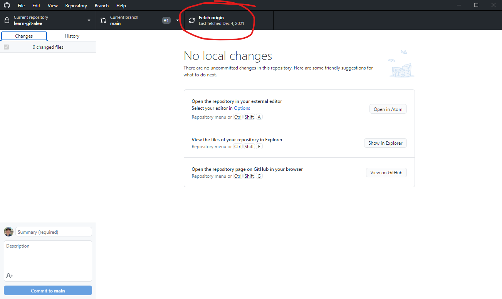
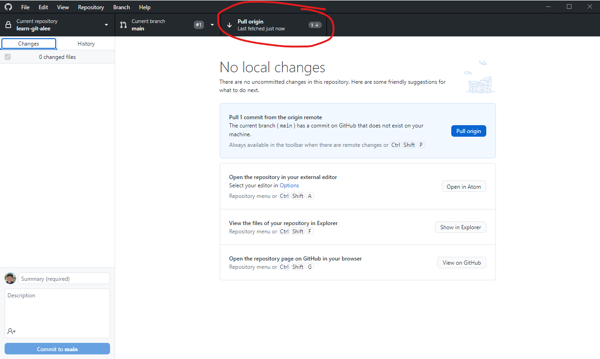

## CoMSES Winter School Homework

This file is your homework submission file. Feel free to edit it!

### Assignment 0

Please clone this repository now. In GitHub Desktop, access the menu options `File -> Clone` repository (or <kbd>Ctrl</kbd> + <kbd>Shift</kbd> + <kbd>O</kbd> on Windows) and enter the URL from the Code button - it should be something like `https://github.com/comses/learn-git-<your-github-username>`

Take note of where your local Git repository is going to be saved, this is the `Local path` shown here:

### Assignment 1

You have three tasks in this assignment:

1. make changes to an existing file in this repository, `homework-submission.md`
2. add a new file with the GitHub web interface, named `a1-github-web.md`
3. add a new file to your local repository using GitHub Desktop named `a1-github-desktop.md`

The contents of these files should be valid GitHub markdown - experiment with the syntax and feel free to add any text you like. Your files should have at least the following types of Markdown content (across all of the files):

1. headers
2. a numbered list
3. a bulleted list
4. at least one hyperlink / URL to a web resource (whatever you like, something interesting to share with the rest of the class, but nothing inappropriate please!)

#### Create a new file: GitHub Web Interface

Create a new file through the GitHub web interface: https://docs.github.com/en/repositories/working-with-files/managing-files/creating-new-files

#### Interlude: synchronize your local repository with the remote GitHub web repository

We just created a new file on our **remote** GitHub repository. But these changes do not exist on our local repository - GitHub Desktop is not like Dropbox (thankfully!). To bring our **remote** changes over to our **local** GitHub repository we'll need to _fetch_ and _pull_ those changes in GitHub Desktop.

First, _fetch_ all changes from the **remote** GitHub repository by clicking this button:

Fetch doesn't change the state of your actual filesystem, it just grabs all the changes that were made and updates the magic `.git` directory. In order to apply those changes to our actual filesystem, we need to *pull* them. You should see something like this:

Click on the `Pull origin` button to bring the new file that you *fetch*ed from your remote git repository into your local git repository into your active filesystem.

#### Create a new file: GitHub Desktop

Create a new file named `a1-github-desktop.md` in your local repository folder. On Windows you can use the Repository menu item `Repository -> Show in Explorer` to go to your local repository folder. Once you've added some text to this file you will see it in your GitHub Desktop UI under the `Changes` tab. 

Check or uncheck the checkboxes to mark which files are to be included in this commit so be sure that you are _only including the files you want to commit_. By default GitHub Desktop checks all new files it finds in the GitHub repository folder that it is currently managing, so you might need to uncheck them if you don't want them getting sent to your remote GitHub repository.

